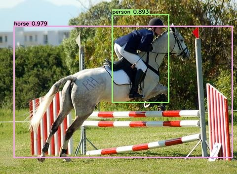

<div align="right">
  Language:
    🇺🇸
  <a title="Chinese" href="./README.zh-CN.md">🇨🇳</a>
</div>

<div align="center"><a title="" href="https://github.com/zjykzj/YOLOv1"></a></div>

<p align="center">
  «YOLOv1» reproduced the paper "You Only Look Once"
<br>
<br>
  <a href="https://github.com/RichardLitt/standard-readme"></a>
  <a href="https://conventionalcommits.org"></a>
  <a href="http://commitizen.github.io/cz-cli/"></a>
</p>

<!-- <style type="text/css">
.tg  {border-collapse:collapse;border-spacing:0;}
.tg td{border-color:black;border-style:solid;border-width:1px;font-family:Arial, sans-serif;font-size:14px;
  overflow:hidden;padding:10px 5px;word-break:normal;}
.tg th{border-color:black;border-style:solid;border-width:1px;font-family:Arial, sans-serif;font-size:14px;
  font-weight:normal;overflow:hidden;padding:10px 5px;word-break:normal;}
.tg .tg-baqh{text-align:center;vertical-align:top}
.tg .tg-c3ow{border-color:inherit;text-align:center;vertical-align:top}
.tg .tg-7btt{border-color:inherit;font-weight:bold;text-align:center;vertical-align:top}
.tg .tg-amwm{font-weight:bold;text-align:center;vertical-align:top}
</style> -->
<table class="tg">
<thead>
  <tr>
    <th class="tg-c3ow"></th>
    <th class="tg-7btt"><span style="font-style:normal">Original (darknet)</span></th>
    <th class="tg-amwm"><span style="font-style:normal">Original (darknet)</span></th>
    <th class="tg-7btt"><a href="https://github.com/abeardear" target="_blank" rel="noopener noreferrer"><span style="text-decoration:none">abeardear</span></a><span style="font-weight:400">/</span><a href="https://github.com/abeardear/pytorch-YOLO-v1" target="_blank" rel="noopener noreferrer">pytorch-YOLO-v1</a></th>
    <th class="tg-7btt"><a href="https://github.com/zjykzj" target="_blank" rel="noopener noreferrer"><span style="text-decoration:none">zjykzj</span></a><span style="font-weight:400">/</span><a href="https://github.com/zjykzj/YOLOv1" target="_blank" rel="noopener noreferrer">YOLOv1</a>(This)</th>
    <th class="tg-7btt"><a href="https://github.com/zjykzj" target="_blank" rel="noopener noreferrer"><span style="text-decoration:none">zjykzj</span></a><span style="font-weight:400">/</span><a href="https://github.com/zjykzj/YOLOv1" target="_blank" rel="noopener noreferrer">YOLOv1</a>(This)</th>
  </tr>
</thead>
<tbody>
  <tr>
    <td class="tg-7btt">arch</td>
    <td class="tg-c3ow">YOLOv1</td>
    <td class="tg-baqh">FastYOLOv1</td>
    <td class="tg-c3ow">ResNet_YOLOv1</td>
    <td class="tg-c3ow">YOLOv1</td>
    <td class="tg-c3ow">FastYOLOv1</td>
  </tr>
  <tr>
    <td class="tg-7btt">train</td>
    <td class="tg-c3ow">VOC07+12 trainval</td>
    <td class="tg-baqh">VOC07+12 trainval</td>
    <td class="tg-c3ow">VOC07+12 trainval</td>
    <td class="tg-c3ow">VOC07+12 trainval</td>
    <td class="tg-c3ow">VOC07+12 trainval</td>
  </tr>
  <tr>
    <td class="tg-7btt">val</td>
    <td class="tg-c3ow">VOC2007 Test </td>
    <td class="tg-baqh">VOC2007 Test </td>
    <td class="tg-c3ow">VOC2007 Test </td>
    <td class="tg-c3ow">VOC2007 Test </td>
    <td class="tg-c3ow">VOC2007 Test </td>
  </tr>
  <tr>
    <td class="tg-7btt">VOC AP[IoU=0.50]</td>
    <td class="tg-c3ow">63.4</td>
    <td class="tg-baqh">52.7</td>
    <td class="tg-c3ow"><span style="font-weight:400;font-style:normal">66.5</span></td>
    <td class="tg-c3ow">52.95</td>
    <td class="tg-c3ow">43.65</td>
  </tr>
  <tr>
    <td class="tg-7btt">conf_thre</td>
    <td class="tg-c3ow">/</td>
    <td class="tg-baqh">/</td>
    <td class="tg-c3ow">0.5</td>
    <td class="tg-c3ow">0.005</td>
    <td class="tg-c3ow">0.005</td>
  </tr>
  <tr>
    <td class="tg-7btt">nms_thre</td>
    <td class="tg-c3ow">/</td>
    <td class="tg-baqh">/</td>
    <td class="tg-c3ow">/</td>
    <td class="tg-c3ow">0.45</td>
    <td class="tg-c3ow">0.45</td>
  </tr>
  <tr>
    <td class="tg-7btt">input_size</td>
    <td class="tg-c3ow">448</td>
    <td class="tg-baqh">448</td>
    <td class="tg-c3ow">448</td>
    <td class="tg-c3ow">448</td>
    <td class="tg-c3ow">448</td>
  </tr>
</tbody>
</table>

## Table of Contents

- [Table of Contents](#table-of-contents)
- [Latest News](#latest-news)
- [Background](#background)
- [Prepare Data](#prepare-data)
  - [Pascal VOC](#pascal-voc)
- [Installation](#installation)
  - [Requirements](#requirements)
  - [Container](#container)
- [Usage](#usage)
  - [Train](#train)
  - [Eval](#eval)
  - [Demo](#demo)
- [Maintainers](#maintainers)
- [Thanks](#thanks)
- [Contributing](#contributing)
- [License](#license)

## Latest News

***14/05/2023: Update Version ([v0.2.0](https://github.com/zjykzj/YOLOv1/releases/tag/v0.2.0)). Update VOC dataset training results for YOLOv1 and FastYOLOv1***

## Background

YOLOv1 is the beginning of the YOLO series, which establishes the basic architecture of the YOLO target detection network. In this repository, I plan to reimplement YOLOv1 to help better understand the YOLO architecture

## Prepare Data

### Pascal VOC

Use this script [voc2yolov5.py](https://github.com/zjykzj/vocdev/blob/master/py/voc2yolov5.py)

```shell
python voc2yolov5.py -s /home/zj/data/voc -d /home/zj/data/voc/voc2yolov5-train -l trainval-2007 trainval-2012
python voc2yolov5.py -s /home/zj/data/voc -d /home/zj/data/voc/voc2yolov5-val -l test-2007
```

Then softlink the folder where the dataset is located to the specified location:

```shell
ln -s /path/to/voc /path/to/YOLOv1/../datasets/voc
```

## Installation

### Requirements

See [NVIDIA/apex](https://github.com/NVIDIA/apex)

### Container

Development environment (Use nvidia docker container)

```shell
docker run --gpus all -it --rm -v </path/to/YOLOv1>:/app/YOLOv1 -v </path/to/voc>:/app/datasets/voc nvcr.io/nvidia/pytorch:22.08-py3
```

## Usage

### Train

* One GPU

```shell
CUDA_VISIBLE_DEVICES=0 python main_amp.py -c configs/yolov1_voc.cfg --opt-level=O1 ../datasets/voc
```

* Multi-GPUs

```shell
CUDA_VISIBLE_DEVICES=0,1,2,3 python -m torch.distributed.launch --nproc_per_node=4 --master_port "36121" main_amp.py -c configs/yolov1_voc.cfg --opt-level=O1 ../datasets/voc
```

### Eval

```shell
python eval.py -c configs/yolov1_voc.cfg -ckpt outputs/yolov1_voc/model_best.pth.tar ../datasets/voc
AP for aeroplane = 0.6014
AP for bicycle = 0.6346
AP for bird = 0.4859
AP for boat = 0.3508
AP for bottle = 0.1631
AP for bus = 0.6230
AP for car = 0.5995
AP for cat = 0.7344
AP for chair = 0.3277
AP for cow = 0.4905
AP for diningtable = 0.5390
AP for dog = 0.7042
AP for horse = 0.7149
AP for motorbike = 0.5984
AP for person = 0.5217
AP for pottedplant = 0.2070
AP for sheep = 0.4724
AP for sofa = 0.5994
AP for train = 0.7180
AP for tvmonitor = 0.5050
Mean AP = 0.5295
python eval.py -c configs/fastyolov1_voc.cfg -ckpt outputs/fastyolov1_voc/model_best.pth.tar ../datasets/voc
AP for aeroplane = 0.5295
AP for bicycle = 0.5318
AP for bird = 0.3408
AP for boat = 0.2591
AP for bottle = 0.1142
AP for bus = 0.5292
AP for car = 0.4835
AP for cat = 0.6586
AP for chair = 0.1839
AP for cow = 0.3956
AP for diningtable = 0.4749
AP for dog = 0.6314
AP for horse = 0.6861
AP for motorbike = 0.5643
AP for person = 0.4172
AP for pottedplant = 0.1275
AP for sheep = 0.3334
AP for sofa = 0.4925
AP for train = 0.6360
AP for tvmonitor = 0.3410
Mean AP = 0.4365
```

### Demo

```shell
python demo.py -c 0.4 configs/yolov1_voc.cfg outputs/yolov1_voc/model_best.pth.tar --exp voc assets/voc2007-test/
```

<p align="left">  </p>

## Maintainers

* zhujian - *Initial work* - [zjykzj](https://github.com/zjykzj)

## Thanks

* [abeardear/pytorch-YOLO-v1](https://github.com/abeardear/pytorch-YOLO-v1)
* [zjykzj/YOLOv2](https://github.com/zjykzj/YOLOv2)
* [zjykzj/anchor-boxes](https://github.com/zjykzj/anchor-boxes)
* [zjykzj/vocdev](https://github.com/zjykzj/vocdev)

## Contributing

Anyone's participation is welcome! Open an [issue](https://github.com/zjykzj/YOLOv1/issues) or submit PRs.

Small note:

* Git submission specifications should be complied
  with [Conventional Commits](https://www.conventionalcommits.org/en/v1.0.0-beta.4/)
* If versioned, please conform to the [Semantic Versioning 2.0.0](https://semver.org) specification
* If editing the README, please conform to the [standard-readme](https://github.com/RichardLitt/standard-readme)
  specification.

## License

[Apache License 2.0](LICENSE) © 2023 zjykzj